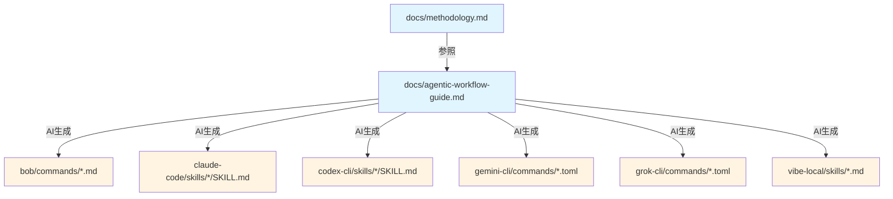
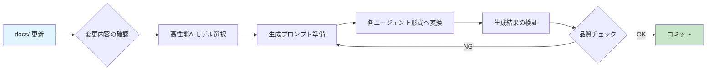

# Agent Workflow Framework

[](LICENSE)
[](https://github.com/daniel-butler-irl/sample-agentic-workflows)

AIコーディングエージェント（Claude、Bob、Gemini、Grok、vibe-local等）と協働するための構造化されたワークフローフレームワーク。

A structured workflow framework for collaborating with AI coding agents (Claude, Bob, Gemini, Grok, vibe-local, etc.).

---

## 📖 概要 / Overview

このフレームワークは、AIエージェントを「記憶喪失の優秀なジュニア開発者」として扱い、効果的に協働するための体系的なワークフローを提供します。

This framework provides a systematic workflow for effective collaboration with AI agents, treating them as "highly capable but amnesiac junior developers."

### 🎯 核心理念 / Core Philosophy

- **新規セッション優先**: タスクごとに新規セッションを開始し、コンテキスト汚染を防ぐ
- **小さな単位**: 1タスク = 1コミット（50-200行、1-5ファイル）
- **ゲートベース検証**: 明確な完了基準で品質を保証
- **人間の認知負荷を考慮**: レビュー可能なサイズに作業を分割

---

- **Fresh sessions first**: Start new sessions per task to prevent context pollution
- **Small units**: 1 task = 1 commit (50-200 lines, 1-5 files)
- **Gate-based verification**: Clear completion criteria ensure quality
- **Human cognitive load**: Work sized for realistic review

---

## ✨ 特徴 / Features

- ✅ **構造化されたワークフロー**: 5つのコアフェーズ + オプションフェーズ
- 🎯 **ゲートベース検証**: 明確な完了基準で品質保証
- 🔄 **複雑度対応**: SIMPLE/COMPLEX評価で適切な計画戦略を選択
- 📝 **テストケース定義**: Test-based Gateの具体的なテストケースを事前定義
- 🤖 **マルチエージェント対応**: 6種類のAIエージェントをサポート
- 📊 **コンテキスト管理**: 50%ルールで自動的にコンテキスト衛生を維持

---

- ✅ **Structured workflow**: 5 core phases + optional phases
- 🎯 **Gate-based verification**: Clear completion criteria ensure quality
- 🔄 **Complexity handling**: SIMPLE/COMPLEX assessment for appropriate planning
- 📝 **Test case definition**: Pre-define concrete test cases for Test-based Gates
- 🤖 **Multi-agent support**: Supports 6 types of AI agents
- 📊 **Context management**: 50% rule maintains context hygiene automatically

---

## 🤖 サポート対象エージェント / Supported Agents

| エージェント / Agent | フォーマット / Format | 特徴 / Features |
|---------------------|---------------------|----------------|
| **Bob** | Markdown Commands | VS Code拡張、コマンドベース |
| **Claude Code** | Skills | Claude公式、スキルシステム |
| **Codex CLI** | Skills | OpenAI Codex、スキルシステム |
| **Gemini CLI** | TOML Commands | Google Gemini、TOMLコマンド |
| **Grok CLI** | TOML Commands | xAI Grok、TOMLコマンド |
| **vibe-local** | Markdown Skills | ローカルLLM、2000文字制限対応 |

各エージェント用のディレクトリに、セットアップ手順と使用方法が記載されています。

Each agent directory contains setup instructions and usage guidelines.

---

## 🚀 クイックスタート / Quick Start

### 1. エージェント固有のファイルをセットアップ

**Bob の場合:**
```bash
cp -r agent-workflow/bob/commands .bob/commands/
cp agent-workflow/bob/AGENTS.md ./AGENTS.md
```

**Claude Code の場合:**
```bash
cp -r agent-workflow/claude-code/skills .claude/skills/
cp agent-workflow/claude-code/CLAUDE.md ./CLAUDE.md
```

**vibe-local の場合:**
```bash
mkdir -p .vibe-local/skills
cp agent-workflow/vibe-local/skills/*.md .vibe-local/skills/
cp agent-workflow/vibe-local/CLAUDE.md ./CLAUDE.md
```

### 2. プロジェクト固有のルールをカスタマイズ

`AGENTS.md` または `CLAUDE.md` を編集して、プロジェクト固有の要件を追加します（200行以内を推奨）。

Edit `AGENTS.md` or `CLAUDE.md` to add project-specific requirements (keep under 200 lines).

### 3. ワークフローを開始

```bash
# 1. 検証ゲートを定義（必須）
/wf-01-define-gates <issue-identifier>

# 2. テストケースを定義（Test-based Gateがある場合のみ）
/wf-15-define-test-cases <issue-identifier>

# 3. タスクを計画
/wf-02-task-plan <issue-identifier>

# 4. タスクを実装
/wf-03-implement <issue-identifier> <task-identifier>

# 5. クリーンアップとPR作成
/wf-04-cleanup <issue-identifier>
```

---

## 📋 ワークフロー構造 / Workflow Structure

### コアワークフロー（必須） / Core Workflow (Required)

```
┌─────────────────────────────────────────────────────────────┐
│ Phase 1: Define Gates (必須 / Required)                     │
│ - 検証戦略の定義 / Define verification strategy             │
│ - 複雑度評価 / Assess complexity (SIMPLE/COMPLEX)           │
│ - 出力: gates.md / Output: gates.md                         │
└─────────────────────────────────────────────────────────────┘
                            ↓
┌─────────────────────────────────────────────────────────────┐
│ Phase 1.5: Define Test Cases (条件付き / Conditional)       │
│ - Test-based Gateの具体化 / Concrete test cases            │
│ - Local/CI実行戦略 / Local/CI execution strategy           │
│ - 出力: test-cases.md / Output: test-cases.md              │
└─────────────────────────────────────────────────────────────┘
                            ↓
┌─────────────────────────────────────────────────────────────┐
│ Phase 2: Task Plan                                          │
│ - SIMPLE: 全タスク一括計画 / Plan all tasks at once        │
│ - COMPLEX: 次タスクのみ計画 / Plan next task only          │
│ - 出力: task-N.md / Output: task-N.md                       │
└─────────────────────────────────────────────────────────────┘
                            ↓
┌─────────────────────────────────────────────────────────────┐
│ Phase 3: Implement                                          │
│ - タスク実装 / Implement task                               │
│ - ゲート検証 / Verify gates                                 │
│ - コミット・PR作成 / Commit & create PR                     │
└─────────────────────────────────────────────────────────────┘
                            ↓
┌─────────────────────────────────────────────────────────────┐
│ Phase 4: Next Task or Cleanup                               │
│ - 残りゲートあり → Phase 2へ / More gates → Phase 2        │
│ - 全ゲート完了 → Phase 5へ / All gates done → Phase 5      │
└─────────────────────────────────────────────────────────────┘
                            ↓
┌─────────────────────────────────────────────────────────────┐
│ Phase 5: Cleanup                                            │
│ - 監査 / Audit                                              │
│ - 修正 / Fix                                                │
│ - 検証 / Validate                                           │
│ - 最終PR作成 / Final PR creation                            │
└─────────────────────────────────────────────────────────────┘
```

### オプションフェーズ / Optional Phases

必要に応じて使用するフェーズ / Use these phases as needed:

- **Issue Plan** (`/wf-issue-plan`): 新規Issueの定義 / Define new issues
- **Investigate** (`/wf-investigate`): コードベース調査 / Investigate codebase
- **Design** (`/wf-design`): インターフェース設計 / Design interfaces
- **ADR** (`/wf-adr`): アーキテクチャ決定記録 / Architecture Decision Records
- **Summarise** (`/wf-summarise`): セッション引き継ぎ / Session handoff
- **Workflow** (`/wf-workflow`): ワークフロー説明 / Workflow explanation

---

## 📚 ドキュメント / Documentation

### 主要ドキュメント / Main Documentation

- **[manifesto.md](docs/explanation/manifesto.md)**: プロジェクト至上命題 — AIによるAI自身の永続的な自己最適化
  - Project manifesto — Perpetual self-optimization by AI, for AI

- **[agentic-workflow-guide.md](docs/agentic-workflow-guide.md)**: 完全なワークフローガイド（英語）
  - Complete workflow guide (English)
  - Core philosophy and design principles
  - Detailed phase descriptions
  - Anti-patterns and best practices

- **[methodology.md](docs/methodology.md)**: 方法論の詳細（日本語・英語）
  - Detailed methodology (Japanese & English)
  - Subagent research patterns
  - Advanced optimization strategies

### エージェント別ドキュメント / Agent-Specific Documentation

各エージェントディレクトリに README.md があります:

Each agent directory contains a README.md:

- [bob/README.md](bob/README.md) - Bob用セットアップ / Bob setup
- [claude-code/README.md](claude-code/README.md) - Claude Code用セットアップ / Claude Code setup
- [codex-cli/README.md](codex-cli/README.md) - Codex CLI用セットアップ / Codex CLI setup
- [gemini-cli/README.md](gemini-cli/README.md) - Gemini CLI用セットアップ / Gemini CLI setup
- [grok-cli/README.md](grok-cli/README.md) - Grok CLI用セットアップ / Grok CLI setup
- [vibe-local/README.md](vibe-local/README.md) - vibe-local用セットアップ / vibe-local setup

---

## 📁 ディレクトリ構造 / Directory Structure

```
agent-workflow/
├── README.md                    # このファイル / This file
├── docs/                        # 📘 ドキュメント（単一の真実の源）
│   │                            # Documentation (Single Source of Truth)
│   ├── agentic-workflow-guide.md  # メインガイド / Main guide
│   └── methodology.md             # 方法論の詳細 / Detailed methodology
│
├── bob/                         # 🤖 Bob用実装（AI生成）
│   │                            # Bob implementation (AI-generated)
│   ├── README.md
│   ├── AGENTS.md
│   └── commands/                # Markdownコマンド / Markdown commands
│       ├── wf-01-define-gates.md
│       ├── wf-02-task-plan.md
│       ├── wf-03-implement.md
│       ├── wf-04-cleanup.md
│       ├── wf-15-define-test-cases.md
│       └── ...
│
├── claude-code/                 # 🤖 Claude Code用実装（AI生成）
│   │                            # Claude Code implementation (AI-generated)
│   ├── README.md
│   ├── CLAUDE.md
│   └── skills/                  # スキル / Skills
│       ├── wf-01-define-gates/
│       ├── wf-02-task-plan/
│       └── ...
│
├── codex-cli/                   # 🤖 Codex CLI用実装（AI生成）
│   │                            # Codex CLI implementation (AI-generated)
│   ├── README.md
│   ├── AGENTS.md
│   └── skills/
│
├── gemini-cli/                  # 🤖 Gemini CLI用実装（AI生成）
│   │                            # Gemini CLI implementation (AI-generated)
│   ├── README.md
│   ├── GEMINI.md
│   └── commands/                # TOMLコマンド / TOML commands
│       ├── wf-01-define-gates.toml
│       └── ...
│
├── grok-cli/                    # 🤖 Grok CLI用実装（AI生成）
│   │                            # Grok CLI implementation (AI-generated)
---

## 📐 アーキテクチャ: ドキュメント生成プロセス / Architecture: Documentation Generation

### Single Source of Truth

このプロジェクトは、ドキュメントの一元管理と自動生成のアーキテクチャを採用しています。

This project adopts a centralized documentation management and automatic generation architecture.

**重要な原則 / Key Principle:**

```
docs/ = 単一の真実の源 (Single Source of Truth)
     ↓ AI生成 (AI Generation)
各エージェント固有ファイル (Agent-specific files)
```

### ドキュメント階層 / Documentation Hierarchy



### 生成プロセスフロー / Generation Process Flow



### 各エージェント形式の特徴 / Agent Format Characteristics

| エージェント | 形式 | 特徴 | 生成時の注意点 |
|------------|------|------|--------------|
| **Bob** | Markdown | フロントマター + 本文 | `description`, `argument-hint` 必須 |
| **Claude Code** | Markdown | SKILL.md形式 | `description` フロントマター必須 |
| **Codex CLI** | Markdown | SKILL.md形式 | Claude Codeと同形式 |
| **Gemini CLI** | TOML | 構造化コマンド | `description`, `prompt` キー必須 |
| **Grok CLI** | TOML | 構造化コマンド | Gemini CLIと同形式 |
| **vibe-local** | Markdown | 2000文字制限 | 簡潔さが最優先、長文は分割 |

### 生成品質の保証 / Generation Quality Assurance

**必須要件 / Required:**
- ✅ 高性能AIモデルの使用（Claude 3.5 Sonnet、GPT-4、Gemini Pro など）
- ✅ 一貫した生成プロンプトの使用
- ✅ 生成後の構文検証（YAML/TOML パーサー）
- ✅ 内容の一貫性チェック

**推奨事項 / Recommended:**
- 📝 生成プロンプトのバージョン管理
- 🔄 定期的な全ファイル再生成（四半期ごと）
- 📊 生成品質のメトリクス収集

---

### なぜこのアーキテクチャか / Why This Architecture?

**利点 / Benefits:**

1. **一貫性の保証**: 単一のソースから生成されるため、内容の一貫性が保たれる
2. **メンテナンス効率**: docs/ のみを更新すれば、全エージェント対応が完了
3. **品質管理**: 生成プロセスを標準化することで、品質を一定に保つ
4. **スケーラビリティ**: 新しいエージェントの追加が容易

**トレードオフ / Trade-offs:**

1. **初期コスト**: 生成プロセスのセットアップに時間がかかる
2. **AI依存**: 高品質な生成には高性能AIモデルが必要
3. **検証負担**: 生成結果の検証が必要

│   ├── README.md
│   ├── GROK.md
│   └── commands/                # TOMLコマンド / TOML commands
│
└── vibe-local/                  # 🤖 vibe-local用実装（AI生成）
    │                            # vibe-local implementation (AI-generated)
    ├── README.md
    └── skills/                  # Markdownスキル（2000文字制限対応）
        ├── wf-01-define-gates.md
        └── ...
```

**重要 / Important:**
- `docs/` = 単一の真実の源（手動編集）/ Single Source of Truth (manual editing)
- その他のエージェントディレクトリ = AI生成ファイル（直接編集禁止）/ AI-generated files (do not edit directly)

詳細は「📐 アーキテクチャ: ドキュメント生成プロセス」セクションを参照してください。

See the "📐 Architecture: Documentation Generation" section for details.

---

## 🎯 設計原則 / Design Principles

### 1. 人間の認知負荷を考慮 / Human Cognitive Load

- **1 Issue = 1つの焦点**: 作業記憶に収まるサイズ
- **1 Task = 1 Commit**: 数分でレビュー可能な差分
- **ゲートベース検証**: 主観的レビューではなく明確な合否基準
- **軽量な設計ドキュメント**: 50-100行、2000行ではない

---

- **1 Issue = 1 focus**: Fits in working memory
- **1 Task = 1 Commit**: Reviewable diffs in minutes
- **Gate-based verification**: Clear pass/fail, not subjective review
- **Lightweight design docs**: 50-100 lines, not 2,000

### 2. LLMコンテキスト制限 / LLM Context Limits

- **50%ルール**: コンテキストウィンドウの50%を超えたら新規セッション
- **タスクごとに新規セッション**: 設計によりコンテキストを制限
- **小さなタスクファイル**: セッションごとの最小限のコンテキスト注入
- **実装ノート**: 完全な会話履歴ではなく、ターゲットを絞ったメモリ

---

- **50% rule**: New session when past 50% of context window
- **Fresh session per task**: Context bounded by design
- **Small task files**: Minimal context injection per session
- **Implementation Notes**: Targeted memory, not full history

### 3. 作業単位のサイジング / Work Unit Sizing

| 単位 / Unit | サイズ / Size | 目的 / Purpose |
|------------|--------------|---------------|
| **Issue** | 1つの焦点 / 1 focus | 明確な目標 / Clear objective |
| **Gate** | 1つの検証基準 / 1 verification criterion | 完了の定義 / Definition of done |
| **Task** | 50-200行、1-5ファイル / 50-200 lines, 1-5 files | レビュー可能な単位 / Reviewable unit |
| **Commit** | 1タスク / 1 task | アトミックな変更 / Atomic change |

---

## 🔧 高度な最適化 / Advanced Optimization

### ローカルレビュー統合 / Local Review Integration

- コミットレベルのレビューをローカルで実行
- GitHub Actionsの使用量を削減
- より早いフィードバックループ

---

- Run commit-level reviews locally
- Reduce GitHub Actions usage
- Faster feedback loop

### 段階的レビュー戦略 / Staged Review Strategy

1. **軽量（無料）**: 静的解析ツール（リンター、型チェッカー）
2. **中程度（有料、選択的）**: タスク完了時の有料AIレビュー
3. **包括的（有料、最終）**: PR作成前の完全レビュー

---

1. **Lightweight (free)**: Static analysis tools (linters, type checkers)
2. **Medium (paid, selective)**: Paid AI review at task completion
3. **Comprehensive (paid, final)**: Full review before PR creation

### メトリクス収集 / Metrics Collection

- レビューメトリクス: レビュー回数、イテレーション、時間
- コストメトリクス: API呼び出し、トークン消費
- 品質メトリクス: テスト失敗率、バグ検出
- 効率メトリクス: タスクあたりの時間、マージ時間

---

- Review metrics: Reviews per commit, iterations, time
- Cost metrics: API calls, tokens consumed
- Quality metrics: Test failure rate, bugs found
- Efficiency metrics: Time per task, merge time

---

## 🚫 アンチパターン / Anti-Patterns

避けるべきパターン / Patterns to avoid:

| アンチパターン / Anti-Pattern | 理由 / Why It Fails | 代わりに / Instead |
|------------------------------|--------------------|--------------------|
| 複数タスクにわたる長いセッション | コンテキスト汚染 | タスクごとに新規セッション |
| 巨大なAGENTS.md（500行以上） | コンテキストが埋まると無視される | 200行以内、必須事項のみ |
| ゲート定義のスキップ | 曖昧な完了基準 | 常に `/wf-01-define-gates` を実行 |
| タスクごとに複数コミット | レビュー不可能な差分 | 各タスク = 1コミット |
| 包括的な事前設計 | 陳腐化、レビュー負担 | 必要に応じてオンデマンド設計 |

---

| Long sessions across tasks | Context pollution | Fresh session per task |
| Massive AGENTS.md (500+ lines) | Ignored as context fills | Under 200 lines, essentials only |
| Skipping gate definition | Vague completion criteria | Always run `/wf-01-define-gates` |
| Multiple commits per task | Unreviewable diffs | Each task = 1 commit |
| Comprehensive upfront design | Goes stale, review burden | Design on-demand when needed |

---

## 🔧 メンテナンスガイドライン / Maintenance Guidelines

### docs/ 更新時の標準手順 / Standard Procedure for docs/ Updates

#### ステップ1: 変更の計画 / Step 1: Plan Changes

```bash
# 1. 変更内容を明確にする
# - どのワークフローフェーズに影響するか？
# - どのエージェントに影響するか？
# - 後方互換性は保たれるか？

# 2. 影響範囲を特定する
grep -r "変更する概念" agent-workflow/*/
```

#### ステップ2: docs/ の更新 / Step 2: Update docs/

```bash
# docs/agentic-workflow-guide.md または docs/methodology.md を編集
# - 明確で簡潔な表現を使用
# - 例を含める
# - 各エージェントで解釈可能な内容にする
```

#### ステップ3: エージェントファイルの再生成 / Step 3: Regenerate Agent Files

**必須条件 / Prerequisites:**
- 高性能AIモデルへのアクセス（Claude 3.5 Sonnet、GPT-4、Gemini Pro など）
- 生成プロンプトの準備（後述）

**生成手順 / Generation Steps:**

```bash
# 1. 影響を受けるエージェントを特定
# 例: wf-01-define-gates を変更した場合
AFFECTED_AGENTS="bob claude-code codex-cli gemini-cli grok-cli vibe-local"

# 2. 各エージェント形式へ変換
# （AIモデルに以下のプロンプトを使用）
```

**生成プロンプトテンプレート / Generation Prompt Template:**

```
あなたは、Agentic Workflow フレームワークのドキュメント変換スペシャリストです。

## タスク
docs/agentic-workflow-guide.md の以下のセクションを、{AGENT_NAME} 形式に変換してください。

## ソースドキュメント
[docs/ の該当セクションを貼り付け]

## ターゲット形式
- エージェント: {AGENT_NAME}
- 形式: {FORMAT} (Markdown/TOML)
- ファイルパス: {TARGET_PATH}

## 変換要件
1. 内容の完全性: ソースの情報をすべて含める
2. 形式の正確性: {AGENT_NAME} の仕様に完全準拠
3. 実行可能性: エージェントが直接実行できる形式
4. 簡潔性: 不要な冗長性を排除（特にvibe-localは2000文字制限）

## 特記事項
- {AGENT_SPECIFIC_NOTES}

出力は、ファイル全体の内容を含めてください。
```

#### ステップ4: 検証 / Step 4: Validation

```bash
# 1. 構文チェック
# YAML/TOMLファイルの場合
yamllint bob/commands/*.md  # フロントマターのチェック
tomlcheck gemini-cli/commands/*.toml

# 2. 内容の一貫性チェック
# - 各エージェントファイルが同じ概念を表現しているか
# - 手順の順序が一致しているか
# - 例が適切か

# 3. 実際のエージェントでテスト
# 各エージェントで簡単なワークフローを実行して動作確認
```

#### ステップ5: コミット / Step 5: Commit

```bash
# 1. docs/ の変更をコミット
git add docs/
git commit -m "docs: Update [変更内容の説明]"

# 2. 生成されたエージェントファイルをコミット
git add bob/ claude-code/ codex-cli/ gemini-cli/ grok-cli/ vibe-local/
git commit -m "chore: Regenerate agent files from docs/ updates

Generated from: [コミットハッシュ]
AI Model: [使用したモデル名]
Affected agents: [影響を受けたエージェントのリスト]"
```

---

### 再生成が必要なケース / When to Regenerate

| 変更の種類 | 再生成の必要性 | 理由 |
|----------|-------------|------|
| **ワークフロー手順の変更** | ✅ 必須 | エージェントの動作に直接影響 |
| **新しいフェーズの追加** | ✅ 必須 | 新しいコマンド/スキルが必要 |
| **例の追加・修正** | ✅ 推奨 | 一貫性の維持 |
| **誤字・脱字の修正** | ⚠️ 状況による | 意味が変わる場合は必須 |
| **フォーマットの調整** | ❌ 不要 | 内容に影響しない |

---

### 品質基準 / Quality Standards

生成されたファイルは以下の基準を満たす必要があります：

**必須基準 / Must Have:**
- ✅ 構文エラーがない（YAML/TOML パーサーで検証）
- ✅ 必須フィールドがすべて含まれている
- ✅ ソースドキュメント（docs/）の内容と一致している
- ✅ エージェントで実行可能である

**推奨基準 / Should Have:**
- 📝 明確で簡潔な表現
- 🎯 具体的な例を含む
- 🔄 他のエージェントファイルと一貫性がある
- 📏 適切な長さ（vibe-localは2000文字以内）

---

### トラブルシューティング / Troubleshooting

#### 問題: 生成されたファイルが動作しない

**原因と対策:**

1. **構文エラー**
   ```bash
   # YAML/TOMLの検証
   yamllint file.md
   tomlcheck file.toml
   ```

2. **必須フィールドの欠落**
   - 各エージェントの仕様を確認
   - 生成プロンプトに必須フィールドを明記

3. **内容の不一致**
   - docs/ の内容を再確認
   - 生成プロンプトを改善

#### 問題: 異なるエージェント間で内容が一致しない

**対策:**
1. すべてのエージェントファイルを削除
2. 同じAIモデルで一括再生成
3. 差分を確認して調整

#### 問題: vibe-localファイルが2000文字を超える

**対策:**
1. 内容を複数のスキルに分割
2. 最も重要な情報のみを含める
3. 詳細は docs/ を参照するよう指示

---

## 📄 ライセンス / License

このプロジェクトはMITライセンスの下で公開されています。

This project is licensed under the MIT License.

## 🙏 謝辞 / Acknowledgments

元リポジトリ / Original repository:
- https://github.com/daniel-butler-irl/sample-agentic-workflows
- Created by Daniel Butler

## 🤝 貢献 / Contributing

貢献を歓迎します！以下の手順でお願いします:

Contributions are welcome! Please follow these steps:

### ワークフロー・ドキュメントへの貢献 / Contributing to Workflow Documentation

**重要 / Important:** エージェント固有ファイル（bob/commands/、claude-code/skills/ など）は AI 生成されたファイルです。これらのファイルを直接編集しないでください。

Agent-specific files (bob/commands/, claude-code/skills/, etc.) are AI-generated. Do not edit them directly.

**正しい貢献方法 / Correct Contribution Process:**

1. **docs/ を編集** / Edit docs/
   ```bash
   # docs/agentic-workflow-guide.md または docs/methodology.md を編集
   # Edit docs/agentic-workflow-guide.md or docs/methodology.md
   ```

2. **変更をコミット** / Commit changes
   ```bash
   git add docs/
   git commit -m "docs: [変更内容の説明]"
   ```

3. **エージェントファイルの再生成** / Regenerate agent files
   - 「🔧 メンテナンスガイドライン」セクションの手順に従う
   - Follow the procedures in the "🔧 Maintenance Guidelines" section

4. **プルリクエストを作成** / Create Pull Request
   - docs/ の変更と再生成されたファイルの両方を含める
   - Include both docs/ changes and regenerated files

### その他の貢献 / Other Contributions

1. このリポジトリをフォーク / Fork this repository
2. フィーチャーブランチを作成 / Create a feature branch
3. 変更をコミット / Commit your changes
4. ブランチをプッシュ / Push to the branch
5. プルリクエストを作成 / Create a Pull Request

---

## 📞 サポート / Support

質問や問題がある場合:

For questions or issues:

- 📖 [ドキュメント](docs/agentic-workflow-guide.md)を確認 / Check the [documentation](docs/agentic-workflow-guide.md)
- 🐛 [Issue](https://github.com/daniel-butler-irl/sample-agentic-workflows/issues)を作成 / Create an [issue](https://github.com/daniel-butler-irl/sample-agentic-workflows/issues)
- 💬 元リポジトリのディスカッションに参加 / Join discussions in the original repository

---

**Happy Coding with AI Agents! 🤖✨**