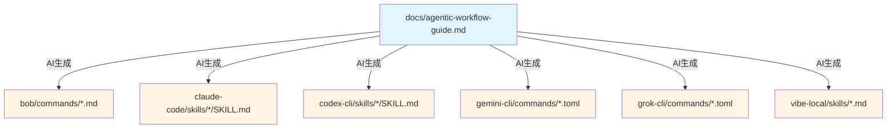
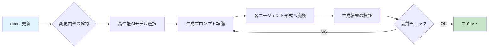

# Documentation Generation Architecture

> docs/ から各エージェント固有ファイルを生成するプロセスと品質管理。

## Single Source of Truth

このプロジェクトは、ドキュメントの一元管理と自動生成のアーキテクチャを採用しています。

This project adopts a centralized documentation management and automatic generation architecture.

```
docs/ = 単一の真実の源 (Single Source of Truth)
     ↓ AI生成 (AI Generation)
各エージェント固有ファイル (Agent-specific files)
```

## Documentation Hierarchy



## Generation Process Flow



## Agent Format Characteristics

| エージェント | 形式 | 特徴 | 生成時の注意点 |
|------------|------|------|--------------|
| **Bob** | Markdown | フロントマター + 本文 | `description`, `argument-hint` 必須 |
| **Claude Code** | Markdown | SKILL.md形式 | `description` フロントマター必須 |
| **Codex CLI** | Markdown | SKILL.md形式 | Claude Codeと同形式 |
| **Gemini CLI** | TOML | 構造化コマンド | `description`, `prompt` キー必須 |
| **Grok CLI** | TOML | 構造化コマンド | Gemini CLIと同形式 |
| **vibe-local** | Markdown | 2000文字制限 | 簡潔さが最優先、長文は分割 |

## Generation Quality Assurance

**必須要件 / Required:**
- 高性能AIモデルの使用（Claude 3.5 Sonnet、GPT-4、Gemini Pro など）
- 一貫した生成プロンプトの使用
- 生成後の構文検証（YAML/TOML パーサー）
- 内容の一貫性チェック

**推奨事項 / Recommended:**
- 生成プロンプトのバージョン管理
- 定期的な全ファイル再生成（四半期ごと）
- 生成品質のメトリクス収集

## Why This Architecture

**利点 / Benefits:**

1. **一貫性の保証**: 単一のソースから生成されるため、内容の一貫性が保たれる
2. **メンテナンス効率**: docs/ のみを更新すれば、全エージェント対応が完了
3. **品質管理**: 生成プロセスを標準化することで、品質を一定に保つ
4. **スケーラビリティ**: 新しいエージェントの追加が容易

**トレードオフ / Trade-offs:**

1. **初期コスト**: 生成プロセスのセットアップに時間がかかる
2. **AI依存**: 高品質な生成には高性能AIモデルが必要
3. **検証負担**: 生成結果の検証が必要

---

## Maintenance Guidelines

### docs/ 更新時の標準手順 / Standard Procedure for docs/ Updates

#### Step 1: Plan Changes

```bash
# 1. 変更内容を明確にする
# - どのワークフローフェーズに影響するか？
# - どのエージェントに影響するか？
# - 後方互換性は保たれるか？

# 2. 影響範囲を特定する
grep -r "変更する概念" agent-workflow/*/
```

#### Step 2: Update docs/

```bash
# docs/agentic-workflow-guide.md を編集
# - 明確で簡潔な表現を使用
# - 例を含める
# - 各エージェントで解釈可能な内容にする
```

#### Step 3: Regenerate Agent Files

**必須条件 / Prerequisites:**
- 高性能AIモデルへのアクセス（Claude 3.5 Sonnet、GPT-4、Gemini Pro など）
- 生成プロンプトの準備（後述）

**生成手順 / Generation Steps:**

```bash
# 1. 影響を受けるエージェントを特定
# 例: wf-01-define-gates を変更した場合
AFFECTED_AGENTS="bob claude-code codex-cli gemini-cli grok-cli vibe-local"

# 2. 各エージェント形式へ変換
# （AIモデルに以下のプロンプトを使用）
```

**生成プロンプトテンプレート / Generation Prompt Template:**

```
あなたは、Agentic Workflow フレームワークのドキュメント変換スペシャリストです。

## タスク
docs/agentic-workflow-guide.md の以下のセクションを、{AGENT_NAME} 形式に変換してください。

## ソースドキュメント
[docs/ の該当セクションを貼り付け]

## ターゲット形式
- エージェント: {AGENT_NAME}
- 形式: {FORMAT} (Markdown/TOML)
- ファイルパス: {TARGET_PATH}

## 変換要件
1. 内容の完全性: ソースの情報をすべて含める
2. 形式の正確性: {AGENT_NAME} の仕様に完全準拠
3. 実行可能性: エージェントが直接実行できる形式
4. 簡潔性: 不要な冗長性を排除（特にvibe-localは2000文字制限）

## 特記事項
- {AGENT_SPECIFIC_NOTES}

出力は、ファイル全体の内容を含めてください。
```

#### Step 4: Validation

```bash
# 1. 構文チェック
# YAML/TOMLファイルの場合
yamllint bob/commands/*.md  # フロントマターのチェック
tomlcheck gemini-cli/commands/*.toml

# 2. 内容の一貫性チェック
# - 各エージェントファイルが同じ概念を表現しているか
# - 手順の順序が一致しているか
# - 例が適切か

# 3. 実際のエージェントでテスト
# 各エージェントで簡単なワークフローを実行して動作確認
```

#### Step 5: Commit

```bash
# 1. docs/ の変更をコミット
git add docs/
git commit -m "docs: Update [変更内容の説明]"

# 2. 生成されたエージェントファイルをコミット
git add bob/ claude-code/ codex-cli/ gemini-cli/ grok-cli/ vibe-local/
git commit -m "chore: Regenerate agent files from docs/ updates

Generated from: [コミットハッシュ]
AI Model: [使用したモデル名]
Affected agents: [影響を受けたエージェントのリスト]"
```

### When to Regenerate

| 変更の種類 | 再生成の必要性 | 理由 |
|----------|-------------|------|
| **ワークフロー手順の変更** | 必須 | エージェントの動作に直接影響 |
| **新しいフェーズの追加** | 必須 | 新しいコマンド/スキルが必要 |
| **例の追加・修正** | 推奨 | 一貫性の維持 |
| **誤字・脱字の修正** | 状況による | 意味が変わる場合は必須 |
| **フォーマットの調整** | 不要 | 内容に影響しない |

### Quality Standards

生成されたファイルは以下の基準を満たす必要があります：

**必須基準 / Must Have:**
- 構文エラーがない（YAML/TOML パーサーで検証）
- 必須フィールドがすべて含まれている
- ソースドキュメント（docs/）の内容と一致している
- エージェントで実行可能である

**推奨基準 / Should Have:**
- 明確で簡潔な表現
- 具体的な例を含む
- 他のエージェントファイルと一貫性がある
- 適切な長さ（vibe-localは2000文字以内）

---

## Troubleshooting

### Problem: Generated files don't work

**原因と対策:**

1. **構文エラー**
   ```bash
   # YAML/TOMLの検証
   yamllint file.md
   tomlcheck file.toml
   ```

2. **必須フィールドの欠落**
   - 各エージェントの仕様を確認
   - 生成プロンプトに必須フィールドを明記

3. **内容の不一致**
   - docs/ の内容を再確認
   - 生成プロンプトを改善

### Problem: Content mismatch across agents

**対策:**
1. すべてのエージェントファイルを削除
2. 同じAIモデルで一括再生成
3. 差分を確認して調整

### Problem: vibe-local files exceed 2000 characters

**対策:**
1. 内容を複数のスキルに分割
2. 最も重要な情報のみを含める
3. 詳細は docs/ を参照するよう指示
